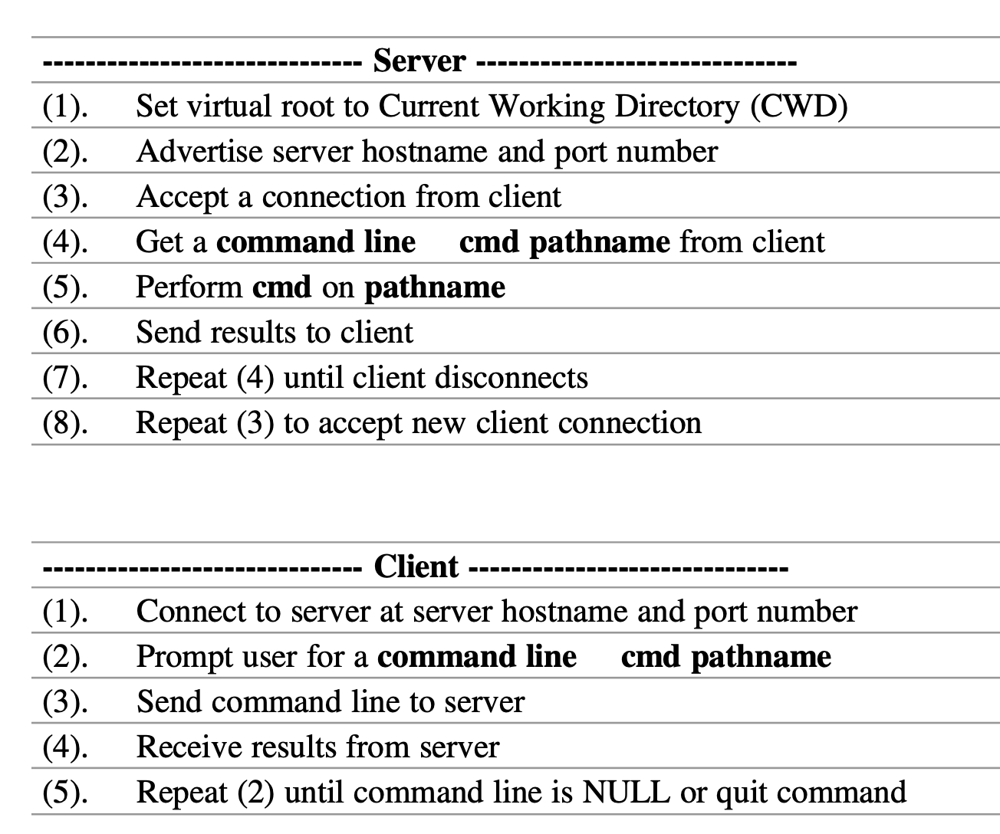

<h1 align="center">TCP Networking in C</h1>

  

  

  

  

A TCP server-client program for preforming file operations locally on the client side and over a network on the server side. This project involves designing and implementing a TCP server and client to perform specified file operations like pwd, cd, ls, and cp, while ensuring correct data transfer through user-level protocols.

Watch the Full Video Demo Here

---

# Table of Contents
- [What I Learned](#what-i-learned-in-this-project)
- [Tools Used / Development Environment](#tools-used--development-environment)
- [Team / Contributors / Teachers](#team--contributors--teachers)
- [How to Set Up](#how-to-set-up)
- [Project Overview](#project-overview)
  - [Introduction](#introduction)
  - [Technical Plan](#technical-plan)
  - [Files and Structure](#files-and-structure)
  - [Results and Observations](#results-and-observations)
  - [Future Work](#future-work)
- [Acknowledgments](#acknowledgments)

---

# What I Learned in this Project
- Programming in C with a focus on parsing command line parameters.
- How to use hostnames, IP addresses, and port numbers over the network.
- Applied user-level protocols for data transfer.
- Enhanced debugging and error handling skills.

# Tools Used / Development Environment
- C
- VS Code
- Terminal
- Ubuntu
- Linux

# Team / Contributors / Teachers
- [Mitchell Kolb](https://github.com/mitchellkolb)
- Professor. K.C. Wang

# How to Set Up
This project was implemented on my local machine inside of a virtual machine using:
- Ubuntu Version 20.04.03 found at this [link](http://lt.releases.ubuntu.com/20.04.3/).
> [!NOTE]
> I had to use this version of Ubuntu but it is not required to run this codebase. 
- Clone this repository 
- Open terminal at the codebase `~.../TCP-file-server/client/` or `~.../TCP-file-server/server/`
- Run my `mk` file to compile the codebase and run the a.out executable.

# Project Overview
I developed a TCP server and client to preform file operations over a network. The project is designed for users to run the client and server in separate terminals. These instances connect, allowing the user to interact with the server through the client terminal. Both the client and server support the `pwd`, `cd`, `ls`, and `cp` commands. The client can execute these commands locally, while when the client sends these commands over the network to the server. The server will then execute them remotely and sends the results over the network for the client to view.

## Introduction
In this project, I used network programming principles to create a TCP server and client capable of performing specified file operations over the Internet. The server is designed to supports commands such as changing directories (`cd`), listing directories (`ls`), displaying the current directory (`pwd`), and copying files (`cp`). Below is a screenshot of the server and client program order of operations.

## Technical Plan
The project employs socket server architecture to handle the incoming client connection. The client sends commands to the server, which executes them and returns the results. The implemented commands include:

- Client
    - `lpwd`: Display the local current working directory on the client.
    - `lcd`: Changes the local current working directory on the client.
    - `lls`: List the contents of the local directory on the client side.
    - `lcp`: Copy a file/data from the client to the server.
- Server:
    - `pwd`: Display the current working directory on the server.
    - `cd`: Change the current working directory on the server.
    - `ls`: List the contents of a directory on the server.
    - `cp`: Copy a file from the server to the client.

User-level protocols ensure correct data transfer between the client and server.

## Files and Structure
- `client.c`: Contains the client code responsible for sending commands to the server and processing the received results. It connects to the server, prompts the user for commands, and handles local file operations.
- `server.c`: Contains the server code responsible for accepting client connections, executing server file operations, and sending results back to the client over the network.

## Results and Observations
During development, my codebase successfully demonstrated the ability to complete basic file operations over the network. 

## Future Work
Future work that can be done on this project can be to make it so multiple instances can connect to the server include more file operation commands such as `mkdir`, `rmdir`. I can also work on enhancing security measures to ensure data integrity and confidentiality during file transfers.

--- 
# Acknowledgments
This codebase and all supporting materials was made as apart of a course for my undergrad at WSU for CPTS 360 - Systems Programming C/C++ in the Spring of 2023. 

